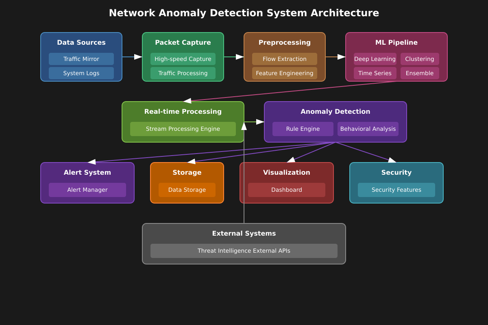

# Leveraging Network Anomaly Detection With Machine Learning

## Advanced Network Anomaly Detection System

**Course:** CENG4252 -- Next‑Generation Network Systems and Architecture  
**Semester:** Spring 2025  
**Project Member:**

| **Name** | **Role** | **Email** |
|----------|----------|-----------|
| Muhammet Ali YILDIZ | Research & Implementation | muhammet.yildiz@ogr.gidatarim.edu.tr |

## Project Description

As advanced and automated computer networks have evolved, fixed networks now carry about 22 EB of traffic per day [[1]](#references), while mobile networks handle roughly 165 EB per month [[2]](#references). Although these improvements benefit our systems, they also enlarge the attack surface. In particular, DDoS attacks increased dramatically in 2025 up 358% year‑over‑year [[3]](#references).

This project aims to detect anomalies from a network‑security perspective because anomalies frequently indicate security breaches such as DDoS attacks [[4]](#references). We will compare traditional, rule‑based approaches with advanced machine‑learning methods and implement usable alert systems and real‑time visualizations for live packet streams.

## Technical Approach

### Data Collection

**Capture:** We will first gather publicly available datasets to train the base model. Afterwards, we will capture traffic on personal devices to fine‑tune the model and try to enable daily batch learning that combines supervised and unsupervised methods.

### Anomaly Detection

We will experiment with different methodologies. Although state‑of‑the‑art models are powerful, network latency and compute resources are critical; hence we will balance accuracy against latency. Feature importance will be explained with SHAP when possible.

| **Approach** | **Method** | **Notes** |
|--------------|------------|-----------|
| **Statistical (baseline)** | Descriptive statistics | Fast drift alarms (e.g. latency spikes). |
| **Unsupervised ML / Clustering** | K‑means, DBSCAN, Gaussian Mixture Models (GMM) | No labels required. However, clustering may struggle with time‑series data [[4]](#references). |
| **Deep Learning** | Autoencoder, Variational Autoencoder | Sequence‑aware anomaly scores. |
| **Graph NN** | GAT on traffic graph | Naturally captures irregular patterns |

### Alerting & Visualization

- **Alert channels**: Webhooks, Telegram bots, Prometheus, E‑mail
- **Dashboard**: Grafana + Prometheus or Streamlit

### Signature & Rule Integration

We will combine our models with well‑known attack signatures, not just static packet metadata or known bad patterns for example, via the Cloudflare Radar API [[5]](#references).

### System Architecture Overview

### Technologies & Tools

- **Languages:** Python
- **Libraries:** scapy, PyShark, pandas, scikit‑learn, PyTorch Lightning, SHAP, Keras
- **Data / Stream:** Kafka, Redis, or another message broker (optional) [[6]](#references)
- **Packet I/O:** tcpdump, AF_PACKET, AF_XDP
- **Infrastructure:** Docker‑based containers
- **Cloud:** Hetzner or DigitalOcean
- **Visualization:** Grafana, Streamlit integrated with Grafana
- **Version Control:** Git + GitHub

## Project Plan

### Timeline & Milestones

| **Week** | **Milestone** |
|----------|---------------|
| 1 | Data gathering; hands‑on packet‑capturing experiments |
| 2 | Feature extraction, preprocessing, and comparison of traditional ML methods |
| 3 | Alpha‑phase demo for core components live demo and supervisor feedback. |
| 4 | Detailed analysis of ML models; implementing advanced models such as autoencoders |
| 5 | Signature fusion + ensemble voting |
| 6 | Implementation of alerting and notification system; Grafana dashboard + Prometheus metrics |
| 7 | Debugging, analysis, and final improvements; documentation |

### Risk Assessment & Mitigation

| **Risk** | **Impact** | **Mitigation** |
|----------|------------|----------------|
| High traffic capture drops | Missed anomalies | Use zero‑copy, kernel‑bypassing methods |
| Label scarcity | Harder ML evaluation | Use public datasets + synthetic attacks; rely on unsupervised scores |
| Alert fatigue (FPs) | System ignored | Threshold tuning, ensemble approach, SHAP explanations, voting with external data |

## Expected Outcomes & Deliverables

- **Live system demo**
- **Dashboards:** real‑time anomaly feed and traffic heat map
- **Alert reports** sent to Telegram / e‑mail
- **Comparative study:** deterministic approaches to reproducibility (fixed feeds, model explainability); isolated experiment environments; Confusion matrix
- **Final report**, **presentation with live demo**, and a **GitHub repository**

## Success Criteria

- **Throughput:** ≥90% packet capture without loss at a typical user speed (~100 Mbps)
- **Detection:** ≥90% recall, ≤5% FPR
- **Latency alerts:** <30 s from anomaly to notification
- **Dashboard usability:** key metrics update ≤5 s

## Testing Approach

1. **Unit tests**
2. **Integration tests**
3. **Data tests**
4. **Load tests** Using synthetic traffic
5. **Synthetic attack injection** (port scan, DDoS) to validate detection and alerting
6. **Statistical evaluation:** IQR and T‑tests for distributional analysis; elbow method and silhouette score for clustering

## References

## References

[1] "Global Internet Phenomena Report 2024," Sandvine, 2024. [Online]. Available: [https://www.sandvine.com/hubfs/Sandvine_Redesign_2019/Downloads/2024/GIPR/GIPR%202024.pdf](https://www.sandvine.com/hubfs/Sandvine_Redesign_2019/Downloads/2024/GIPR/GIPR%202024.pdf)

[2] "Ericsson Mobility Report: Mobile Traffic Forecast," Ericsson, 2024. [Online]. Available: [https://www.ericsson.com/en/reports-and-papers/mobility-report/dataforecasts/mobile-traffic-forecast](https://www.ericsson.com/en/reports-and-papers/mobility-report/dataforecasts/mobile-traffic-forecast)

[3] "DDoS Threat Report Q1 2025," Cloudflare, 2025. [Online]. Available: [https://blog.cloudflare.com/ddos-threat-report-for-2025-q1/](https://blog.cloudflare.com/ddos-threat-report-for-2025-q1/)

[4] "Anomaly Detection Overview," VMware, 2024. [Online]. Available: [https://www.vmware.com/topics/anomaly-detection](https://www.vmware.com/topics/anomaly-detection)

[5] "Cloudflare Radar - Application Layer Security," Cloudflare, 2025. [Online]. Available: [https://radar.cloudflare.com/security/application-layer](https://radar.cloudflare.com/security/application-layer)

[6] "Lessons Learned from Scaling Up Cloudflare Anomaly Detection Platform," Cloudflare Blog, 2024. [Online]. Available: [https://blog.cloudflare.com/lessons-learned-from-scaling-up-cloudflare-anomaly-detection-platform/](https://blog.cloudflare.com/lessons-learned-from-scaling-up-cloudflare-anomaly-detection-platform/)

[7] "Anomaly Detection Role in Networks," Pingplotter, 2024. [Online]. Available: [https://www.pingplotter.com/wisdom/article/anomaly-detection-role-in-networks/](https://www.pingplotter.com/wisdom/article/anomaly-detection-role-in-networks/)

[8] M. Ahmed, A. N. Mahmood, and J. Hu, "A survey of network anomaly detection techniques," *Journal of Network and Computer Applications*, vol. 60, pp. 19-31, 2016. [Online]. Available: [https://doi.org/10.1016/j.jnca.2015.11.016](https://doi.org/10.1016/j.jnca.2015.11.016)

[9] M. Rabbani, Y. Wang, R. Khoshkangini, H. Jelodar, R. Zhao, S. Bagheri Baba Ahmadi, and S. Ayobi, "A Review on Machine Learning Approaches for Network Malicious Behavior Detection in Emerging Technologies," *Entropy*, vol. 23, no. 5, p. 529, 2021. [Online]. Available: [https://doi.org/10.3390/e23050529](https://doi.org/10.3390/e23050529)

[10] P. Schummer, A. del Rio, J. Serrano, D. Jimenez, G. Sánchez, and Á. Llorente, "Machine Learning-Based Network Anomaly Detection: Design, Implementation, and Evaluation," *AI*, vol. 5, no. 4, pp. 2967-2983, 2024. [Online]. Available: [https://doi.org/10.3390/ai5040143](https://doi.org/10.3390/ai5040143)
